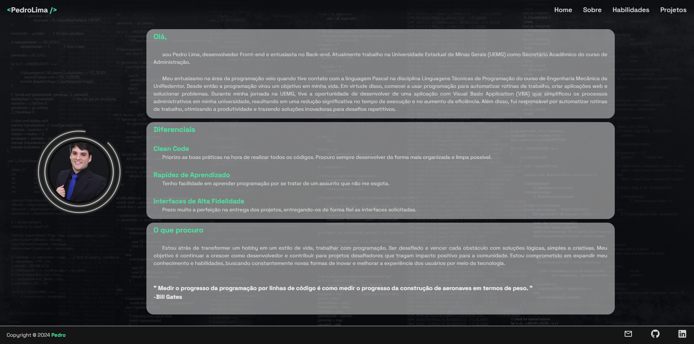
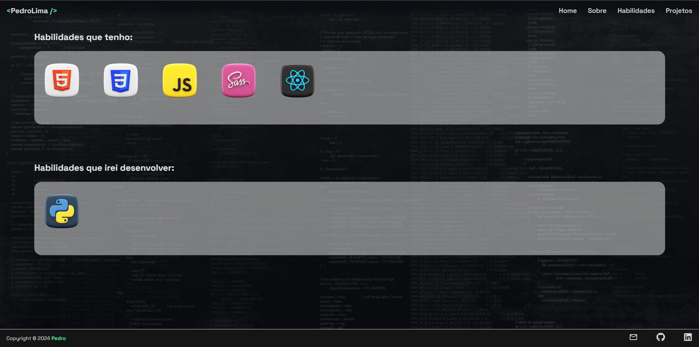
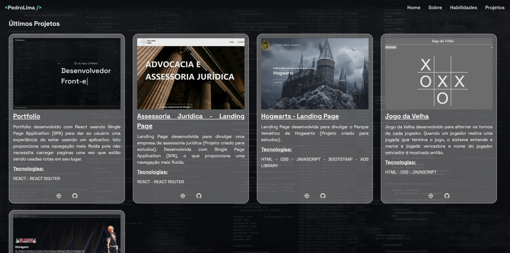

# My Portfolio

  

  

  

  

## Descrição

Este é o meu portfolio. Desenvolvido usando a arquitetura da Single Page Application (SPA) para criar, no usuário,  a sensação de uso de um aplicativo nativo, usando rotas ao invés de páginas, gerando mais fluidez à navegação.

## Funcionalidades

1. **Home**: Página inicial;

2. **Sobre**: Informações sobre mim, destacando minha trajetória como dev, meus diferenciais e o que busco como dev;

3. **Habilidades**: Rota responsável por apresentar as tecnologias que eu possuo conhecimento e as que estou estudando;

4. **Projetos**: Mostra os últimos projetos que desenvolvi, seja para cliente ou apenas demonstrações de habilidades.

## Ferramentas Utilizadas

1. **ReactJS + Vite.js**: Foi utilizado o ReactJS juntamente com o Vite.js para o desenvolvimento rápido e eficiente da interface do usuário;

2. **Ícones do React-Icons**: Foram incorporados ícones do React-Icons para uma experiência visual agradável e intuitiva.

3. **React Simple Typewriter**: Foi usado o react-simple-typewriter na home do projeto para dar um efeito visual.

---

## Outras imagens ##

## Autor ##

Desenvolvido por <a href="https://github.com/Striffer" target="_blank">Pedro Lima</a>

&#xa0;

<a href="#top">Voltar ao topo</a>